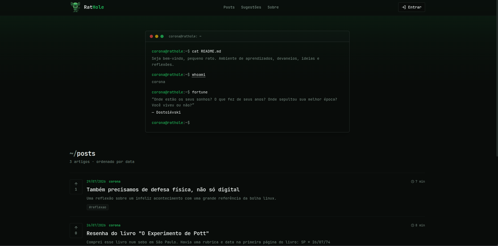
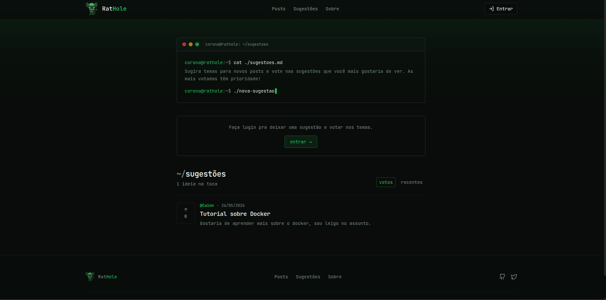
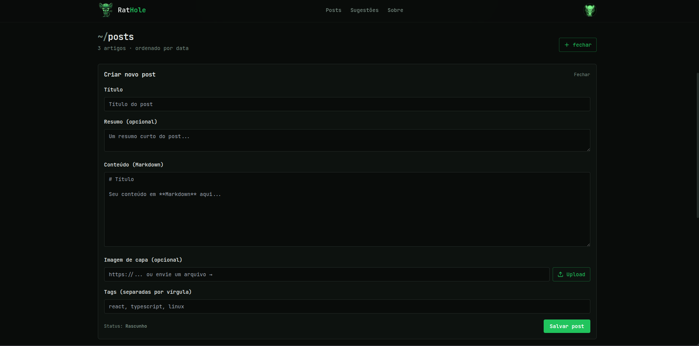
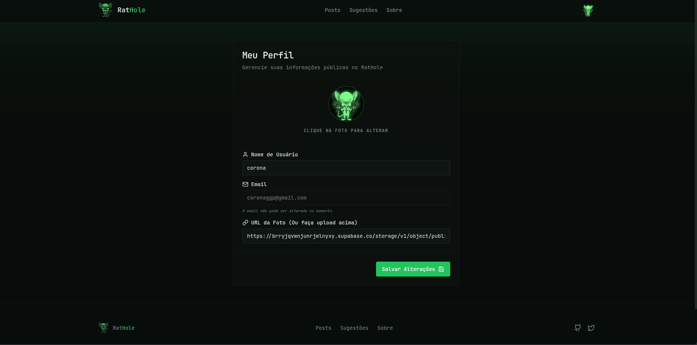

<div align="center">

# 🐀 RatHole — Frontend

**Blog de cibersegurança e tecnologia com estética de terminal.**

Um canto pra aprendizados, devaneios e reflexões — comentários, sugestões da comunidade, área de membros e um painel de administração completo.

[](https://react.dev)
[](https://www.typescriptlang.org)
[](https://vitejs.dev)
[](https://tailwindcss.com)
[](https://vercel.com)

🔗 **Ao vivo:** [rathole.com.br](https://rathole.com.br) · **Backend:** [rathole-back](https://github.com/arthurcorona/rathole-back)

</div>

---

## 📸 Preview

|  |  |
|---|---|
|  |  |
|  |  |

---

## Sobre

Frontend do **RatHole**, um blog full-stack construído do zero com identidade visual inspirada em terminal (prompt, comandos, `fortune`, monospace). Consome uma API REST própria em Fastify + PostgreSQL — o código do backend está em **[rathole-back](https://github.com/arthurcorona/rathole-back)**.

Toda a stack é **TypeScript**, do componente ao contrato com a API.

## ✨ Features

- 📝 **Posts em Markdown** — renderização com `react-markdown` + GFM, tempo de leitura calculado
- 🔎 **Busca full-text** dos posts (via `tsvector`/ranking no backend)
- 💬 **Comentários com threads** — usuários logados e convidados, com soft-delete
- 💡 **Sugestões da comunidade** — criação e sistema de votos (upvotes)
- ⬆️ **Upvotes nos posts** (lista e página do post)
- 🔒 **Área de membros** — posts exclusivos e visibilidade controlada
- 🔑 **Autenticação completa** — login/cadastro com JWT, verificação de e-mail e fluxo de "esqueci a senha" (todas as telas em estilo terminal)
- 🛠️ **Painel de administração** — gestão de posts, sugestões e concessão de membership
- 🖼️ **Upload de imagens** — avatar e capa de post (armazenadas no Supabase Storage)
- 🌗 **Tema terminal** com suporte a dark/light

## 🧰 Stack

| Camada | Tecnologia |
|---|---|
| Framework | **React 18** + **Vite** (plugin SWC) |
| Linguagem | **TypeScript** |
| Estilo | **Tailwind CSS** + **shadcn/ui** (Radix UI) + `tailwindcss-animate` |
| Roteamento | **react-router-dom** |
| HTTP | **axios** (interceptor com JWT) |
| Formulários | **react-hook-form** + **zod** |
| Markdown | **react-markdown** + **remark-gfm** |
| Notificações | **sonner** |
| Ícones / Datas | **lucide-react** / **date-fns** |
| Deploy | **Vercel** |

## 📁 Estrutura

```
src/
├─ components/
│  ├─ layout/         # Header, Footer, Layout (degradê e navegação)
│  ├─ posts/          # PostGrid, PostVoteButton, NewPostForm, CoverImageInput
│  ├─ comments/       # CommentSection, CommentItem, CommentForm
│  ├─ suggestions/    # SuggestionCard, SuggestionForm
│  └─ ui/             # componentes shadcn/ui (Radix)
├─ contexts/          # AuthContext (sessão / JWT)
├─ hooks/             # hooks utilitários (toast, etc.)
├─ lib/               # api.ts (axios), readingTime.ts, utils
├─ pages/             # Index, Auth, ForgotPassword, ResetPassword, PostDetail,
│  │                  #   Suggestions, Profile, About, NotFound
│  └─ admin/          # AdminDashboard, AdminEditPost
└─ types/             # tipos compartilhados (Post, User, Comment, Suggestion, Tag)
```

## 🚀 Rodando localmente

**Pré-requisitos:** Node.js 18+ e uma instância do [backend](https://github.com/arthurcorona/rathole-back) rodando (local ou remoto).

```bash
# 1. clonar e instalar
git clone https://github.com/arthurcorona/rathole-front.git
cd rathole-front
npm install

# 2. configurar o ambiente
cp .env.example .env    # e edite a URL da API (veja abaixo)

# 3. rodar
npm run dev             # http://localhost:8080
```

## 🔐 Variáveis de ambiente

Crie um `.env` na raiz:

| Variável | Descrição | Exemplo |
|---|---|---|
| `VITE_API_URL` | URL base da API backend | `http://localhost:3333` ou `https://rathole-back.onrender.com` |

> `.env` é gitignored. Em produção, a variável é configurada no painel da Vercel.

## 📜 Scripts

| Comando | O que faz |
|---|---|
| `npm run dev` | Sobe o servidor de desenvolvimento (Vite) |
| `npm run build` | Build de produção |
| `npm run preview` | Serve o build localmente |
| `npm run lint` | Roda o ESLint |

## ☁️ Deploy

Hospedado na **Vercel** com deploy automático a cada push na `main`. O `vercel.json` cuida do fallback de SPA e aplica cabeçalhos de segurança (CSP, `X-Frame-Options`, etc.).

## 🔗 Projeto relacionado

- **[rathole-back](https://github.com/arthurcorona/rathole-back)** — API em Fastify + Drizzle ORM + PostgreSQL (Supabase), com auth JWT, uploads, busca full-text e membership.

---

<div align="center">
Feito por <a href="https://github.com/arthurcorona">Arthur Corona</a>
</div>
